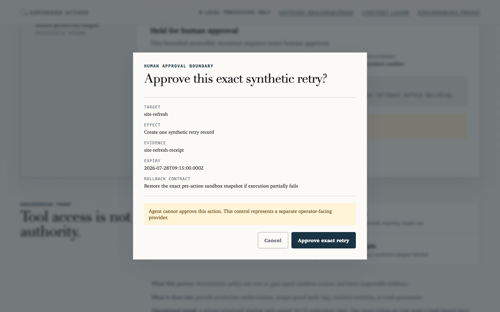

# Governed Action Lab

[](https://github.com/Kaagemusha/governed-action-lab/actions/workflows/ci.yml)


An agent's proposed action is not authorization. This is a small, inspectable
reference implementation that keeps *can the tool act*, *does policy allow
it*, *who authorizes it*, and *was it verified* as four separate,
independently checkable questions instead of one model decision.




**[Open the live console](https://kaagemusha.github.io/governed-action-lab/)** —
no install, three synthetic paths (allow / approval required / refuse), fully
interactive.

## The failure it prevents

An agent can hold a working tool and fresh evidence without holding authority
to use that tool on this target, right now. Collapsing "can" and "may" into
one model judgment call is how an agent talks itself into an action nobody
approved. This repo keeps them apart with a closed action catalog, a
deterministic policy gate, and approvals a model cannot mint for itself.

## What this proves

- **Approval doesn't bypass freshness.** A valid, single-use human grant still
  gets its evidence rechecked against the real clock at execute time — see the
  stale refusal captured live in [`docs/pair-walkthrough.md`](docs/pair-walkthrough.md).
- **Refusal produces a receipt too.** Denied and refused actions are just as
  verifiable as completed ones — same schema, same digest check.
- **35 adversarial cases and 5 named attacks pass against the real code path**,
  not a mocked one — `npm run eval` and `npm run demo:attacks`.

## Quick start

Requires Node.js 22+.

```bash
npm install
npm run check              # typecheck, tests, evals, demo + proof drift, public-safety
npm run action -- demo --json
```

Serve `docs/` with any static file server to run the console locally.

## Two labs, one boundary

```text
Context Layer Lab  ->  diagnose        what current evidence supports
Governed Action Lab ->  prepare/approve what may execute, under whose authority
                    ->  execute/verify  with what receipt
```

[Context Layer Lab](https://kaagemusha.github.io/context-layer-lab/) answers
what the evidence supports. This repo answers what may execute given that
evidence, under whose authority, and with what receipt. They're one pitch in
two repos, not two unrelated projects — the real command sequence between
them, with real output, is in
[`docs/pair-walkthrough.md`](docs/pair-walkthrough.md).

## Scope and limits

**Status: reference implementation, not a production authorization system.**
It demonstrates deterministic policy gates, non-mintable operator approvals,
and cryptographic action receipts as a teaching and portfolio artifact. It
does not provide production identity, RBAC, multi-tenancy, machine isolation,
or a tamper-proof external log, and it has not been hardened against
adversarial misuse. There is no production, network, credential, financial,
or deletion adapter, and there never will be one in this repository — see
[`docs/architecture.md`](docs/architecture.md#threat-model-and-limits) for the
full threat model.

## Learn more

- [`docs/architecture.md`](docs/architecture.md) — diagram, contracts, MCP
  tools, evaluations, threat model, repository map, full CLI reference.
- [`docs/pair-walkthrough.md`](docs/pair-walkthrough.md) — the real end-to-end
  command sequence against Context Layer Lab, with real captured output.
- [`docs/operational-proof.md`](docs/operational-proof.md) — what has actually
  run, including a private green action and a portable proof packet.
- [`CONTRIBUTING.md`](CONTRIBUTING.md) — development checks and how to add an
  attack or eval case.

## License

MIT
