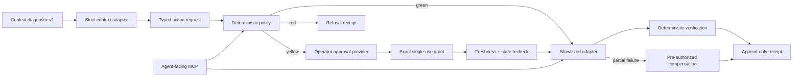

# Governed Action Lab

A small, inspectable reference implementation showing that an agent's proposed
action is not authorization.

**[Open the live governed-action console](https://kaagemusha.github.io/governed-action-lab/)**

The lab places a deterministic governance boundary between a typed proposal and
an executor. It makes evidence, policy, authority, execution, verification, and
rollback inspectable without granting an agent the ability to approve its own
mutation.

## The failure it prevents

An agent may have access to a tool and current evidence without having authority
to use that tool. Treating capability as permission collapses three different
questions:

```text
Can the tool perform this effect?
Does policy allow this exact effect?
Who may authorize it?
```

Governed Action Lab keeps those questions separate. The policy engine uses a
closed action catalog, never a model or free-form shell analysis.

## Three paths

The public scenario is synthetic:

| Proposed action | Class | Disposition | Executable path |
|---|---|---|---|
| Inspect a failed run receipt | Green | Allow | Read-only adapter |
| Retry the failed lane | Yellow | Approval required | Exact, expiring, single-use human approval followed by a reversible sandbox adapter |
| Delete preserved output | Red | Refuse | None; approval cannot override refusal |

The console presents all three paths without navigation. Browser execution is
explicitly a synthetic demonstration and never touches an external system.

## Two-minute quick start

Requires Node.js 22 or newer.

```bash
npm install
npm run check
npm run action -- demo --json
```

Serve `docs/` with any static file server to use the local-first console.

Artifact-oriented commands:

```bash
npm run fixture:fresh -- --output /tmp/governed-diagnostic.json

npm run action -- prepare \
  --diagnostic /tmp/governed-diagnostic.json \
  --action retry_failed_lane \
  --lane site-refresh \
  --output /tmp/action-review.json \
  --brief-output /tmp/action-review.md
```

`prepare` is the operator-facing read path. It validates the diagnostic,
creates the typed request, evaluates policy, and simulates the projected effect
as one strict `governed-action-review/v1` packet. It never approves or executes.
The optional six-line brief reports the action, evidence boundary, required
authority, and next step without a model call.

### Operational proof

The review path runs after a scheduled private context diagnostic. A supervised
10-case shadow pilot covered healthy, failed, preserved-local, missing, stale,
contradictory, mixed, unavailable-runtime, transition, and deterministic-replay
states. All cases passed without creating an approval or mutation artifact.

One bounded green action now runs privately after that review: it inspects one
hash-bound local evidence file through a root-confined, non-symlink, read-only
adapter and writes at most one immutable receipt per day. The live receipt
verified its schema and digest, carried no approval, matched the diagnostic's
source hash, and recorded identical before/after hashes. Immediate replay reused
the receipt and changed no files. Yellow execution remains disabled.

A separate supervised yellow proof ran only in the bundled synthetic sandbox.
The operator had to type the literal approval in an interactive terminal after
seeing the exact target, effect, evidence, expiry, and rollback contract. The
resulting five-minute, single-use grant bound the request and decision; execution
rechecked current state, wrote one synthetic retry record, and produced a valid
receipt. Replay returned that same receipt without a second effect. Compensation
was pre-authorized but not needed. No external system was connected or changed.

The public console uses synthetic data to show the same status and authority
boundary. No private diagnostic, receipt, lane identifier, path, hostname, or
operating record is published in this repository.

The lower-level lifecycle remains available for inspecting each boundary:

```bash
npm run action -- propose \
  --diagnostic /tmp/governed-diagnostic.json \
  --action retry_failed_lane \
  --lane site-refresh \
  --output /tmp/action-request.json

npm run action -- evaluate \
  --diagnostic /tmp/governed-diagnostic.json \
  --request /tmp/action-request.json \
  --output /tmp/action-decision.json

npm run action -- approve \
  --request /tmp/action-request.json \
  --decision /tmp/action-decision.json \
  --approval-store /tmp/governed-action-demo/approvals.json \
  --operator reviewer \
  --output /tmp/action-approval.json

npm run action -- execute \
  --diagnostic /tmp/governed-diagnostic.json \
  --request /tmp/action-request.json \
  --decision /tmp/action-decision.json \
  --approval-store /tmp/governed-action-demo/approvals.json \
  --receipt-store /tmp/governed-action-demo/receipts.json \
  --sandbox /tmp/governed-action-demo/sandbox \
  --output /tmp/action-receipt.json
```

`approve` is an interactive operator command. It displays the exact target,
effect, evidence, five-minute expiry, and rollback contract before accepting
the literal confirmation `APPROVE`. `execute` discovers a separately stored
approval and rejects `--approve`, `--yes`, and inline approval text.
`fixture:fresh` shifts only the bundled synthetic example to the current wall
clock so its one-day evidence window remains meaningful. Production execution
always uses the system clock and has no `--at` override.

## Context Layer Lab relationship

[Context Layer Lab](https://kaagemusha.github.io/context-layer-lab/) answers:
**what current evidence supports the conclusion?**

Governed Action Lab answers: **given that evidence, what may execute, under
whose authority, and with what receipt?**

Together they form a deliberately narrow handoff from evidence reconciliation
to bounded execution, rather than one agent-controlled system that conflates
truth, permission, and authority.

The frozen public fixture consumes `context-layer-diagnostic/v1` from producer
commit `b0179a8e365ab35691864e55d5792db1bdefbcb2`. The consumer validates the
complete packet, binds the request to its SHA-256 digest, and independently
checks the selected lane's latest raw receipt. It does not import sibling source
files or duplicate the producer's broader health logic.

```text
Context diagnostic v1
  -> strict consumer adapter
  -> typed action request
  -> deterministic policy gate
  -> allow / approval boundary / refusal
  -> precondition recheck
  -> allowlisted synthetic adapter
  -> verification and append-only receipt
```

## Architecture



The contracts, canonical hashing, context adapter, policy, approval provider,
executor, sandbox adapter, stores, CLI, MCP server, and browser are separate
layers. Browser decisions are compiled from the same core policy code rather
than reimplemented.

## Contracts

Strict Zod schemas reject unknown keys at persisted and transport boundaries:

- `governed-action-review/v1`
- `governed-action-request/v1`
- `governed-action-decision/v1`
- `governed-action-approval/v1`
- `governed-action-receipt/v1`
- `governed-action-policy/v1`
- frozen consumer for `context-layer-diagnostic/v1`

Canonical JSON recursively sorts keys and rejects non-JSON values before
SHA-256 hashing. An approval binds both the complete request digest and the
decision digest. Receipts describe bounded resources and before/after hashes.

Receipts are append-only in this implementation, not tamper-proof audit logs.
Digest verification detects changed content; it does not defend against a
process that controls the machine and can rewrite both data and code.

## MCP tools

| Tool | Effect |
|---|---|
| `evaluate_action` | Read-only validation and policy evaluation |
| `explain_action_decision` | Read-only explanation |
| `simulate_action` | Read-only projected effect |
| `execute_approved_action` | Synthetic sandbox only; requires a separate stored approval |
| `verify_action_receipt` | Read-only schema and digest verification |

There is no approval-creation MCP tool. The executor tool accepts an action
identifier, not an approval payload or command string.

## Evaluations

`npm run eval` executes 34 deterministic adversarial cases and compares actual
structured output with explicit expected output. Coverage includes:

- unknown action, adapter, environment, diagnostic, and command-shaped input;
- green mutation mismatch and red action with a valid-looking approval;
- changed, expired, replayed, tampered, and earlier-decision approvals;
- evidence expiry, missing evidence, invalid quality, contradictory
  assessments, and newer success before retry;
- idempotency, failures before and after effect, compensation, verification
  mismatch, and tampered receipts;
- absent approval providers, MCP capability limits, forged browser decisions,
  generated-demo drift, policy change after approval, review-only preparation,
  and review-packet tampering.

`npm run qa:responsive` launches an isolated local Chrome instance and asserts
that the document and every rendered element remain within 320, 375, and 390px
viewports.

## Threat model and limits

The lab demonstrates deterministic refusal and approval binding. It does not
provide:

- production authorization, OAuth, RBAC, multi-tenancy, or machine isolation;
- a security boundary against a process already controlling the local machine;
- tamper-proof or externally anchored audit logs;
- proof that supplied evidence is factually true;
- a production, network, repository, deployment, communication, credential,
  financial, account, or deletion adapter;
- natural-language risk classification or arbitrary command execution;
- a replacement for Context Layer Lab retrieval or a private write-admission
  protocol.

Freshness means evidence remains within its declared time boundary. It is not a
truth score. The public synthetic executor proves orchestration semantics, not
production safety.

## Repository map

```text
data/       fixed public policy
docs/       dependency-light local-first console
evals/      explicit adversarial expectations
examples/   synthetic diagnostic and fixture metadata
scripts/    generated-runtime, drift, responsive, and public-safety gates
src/        contracts and independent governance layers
test/       unit and protocol contract tests
```

## Development checks

```bash
npm run typecheck
npm test
npm run eval
npm run demo:check
npm run qa:responsive
npm run public-safety:check
npm run check
```

`npm run check` is network-independent after installation. Runtime files and
the public sample are generated deterministically; drift fails the gate.

Before publishing, configure a private newline-delimited pattern file and
install the fail-closed pre-push hook:

```bash
git config publicSafety.patternsFile /path/to/private-patterns
npm run public-safety:install
```

The hook scans the current tree and every outgoing commit, so adding and then
deleting private data in one push is still blocked. CI repeats the generic scan.

## Rollback

Each implementation phase is a separate commit. Revert the smallest phase
commit rather than resetting unrelated work:

```bash
git revert <phase-commit>
```

## License

MIT
