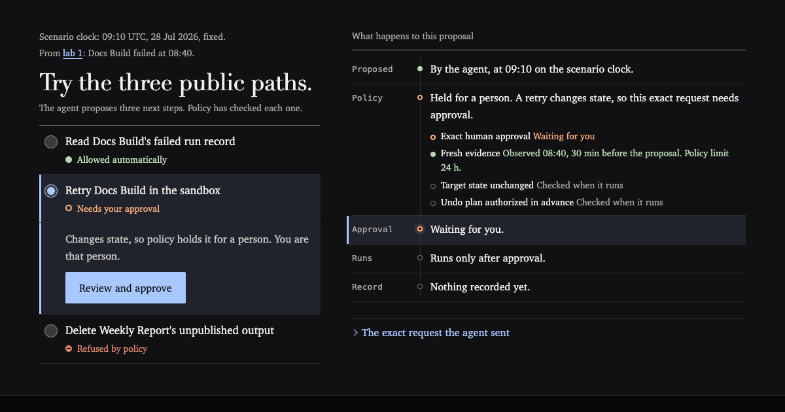

# Governed Action Lab

[](https://github.com/Kaagemusha/governed-action-lab/actions/workflows/ci.yml)


[](https://kaagemusha.github.io/governed-action-lab/)

An agent's proposed action is not authorization. This is a small, inspectable
reference implementation that keeps *can the tool act*, *does policy allow
it*, *who authorizes it*, and *was it verified* as four separate,
independently checkable questions instead of one model decision.

**[Open the live console](https://kaagemusha.github.io/governed-action-lab/)**:
no install, three synthetic paths (allow / approval required / refuse), fully
interactive.

## The failure it prevents

```text
Docs Build failed at 08:40. At 09:10 the agent proposes three next steps:

read Docs Build's failed run record          ->  allowed, runs now
retry Docs Build in the sandbox              ->  held for one human approval
delete Weekly Report's unpublished output    ->  refused by policy
```

An agent can hold a working tool and fresh evidence without holding authority
to use that tool on this target, right now. Collapsing "can" and "may" into
one model judgment call is how an agent talks itself into an action nobody
approved. This repo keeps them apart with a closed action catalog, a
deterministic policy gate, and approvals that none of the agent's tools can
create.

## What this proves

- **Approval doesn't bypass freshness.** A valid, single-use human grant still
  gets its evidence rechecked against the real clock at execute time. See the
  stale refusal captured live in [`docs/pair-walkthrough.md`](docs/pair-walkthrough.md).
- **Refusal produces a receipt too.** Denied and refused actions are just as
  verifiable as completed ones: same schema, same digest check.
- **36 eval cases, 26 of them adversarial, pass against the real code path**,
  not a mocked one (`npm run eval`). The other 10 are 3 fault injections and 7
  intended-path checks.
- **11 named attacks, each mapped to OWASP LLM Top 10, MITRE ATLAS, or CWE,
  are held** (`npm run demo:attacks`,
  [`docs/attack-matrix.md`](docs/attack-matrix.md)).
- **A policy is trusted by content, not by name.** The bundled public policy
  is pinned to the digest of its exact manifest, so a look-alike with the same
  ID and version is refused.

## Quick start

Requires Node.js 22+.

```bash
npm install
npm run check              # public-safety, contract, one clean typechecked
                           # build, tests, evals, attack demo, demo and proof
                           # drift, responsive layout
npm run action -- demo --json
```

Serve `docs/` with any static file server to run the console locally.

## Two labs, one boundary

```text
Context Layer Lab   ->  diagnose        what current evidence supports
Governed Action Lab ->  prepare/approve what may execute, under whose authority
                    ->  execute/verify  with what receipt
```

[Context Layer Lab](https://github.com/Kaagemusha/context-layer-lab)
([live diagnostic](https://kaagemusha.github.io/context-layer-lab/)) answers
what the evidence supports. This repo answers what may execute given that
evidence, under whose authority, and with what receipt. They are one system in
two repos, not two unrelated projects. The real command sequence between
them, with real output, is in
[`docs/pair-walkthrough.md`](docs/pair-walkthrough.md).

## Scope and limits

**Status: reference implementation, not a production authorization system.**
It demonstrates deterministic policy gates, operator approvals the agent's
tools cannot create, and hash-bound, tamper-evident action receipts as a
teaching and reference artifact. Digests are unkeyed SHA-256, not signatures:
they detect edits, but anything with write access to the approval store or
the receipts can produce valid-looking ones, so a real deployment keeps those
out of the agent's reach. It does not provide production identity, RBAC,
multi-tenancy, machine isolation, or a tamper-proof external log, and it has
not been hardened against adversarial misuse. There is no production, network, credential, financial,
or deletion adapter, and there never will be one in this repository. See
[`docs/architecture.md`](docs/architecture.md#threat-model-and-limits) for the
full threat model.

## Learn more

- [`docs/architecture.md`](docs/architecture.md): diagram, contracts, MCP
  tools, evaluations, threat model, and full CLI reference.
- [`docs/attack-matrix.md`](docs/attack-matrix.md): all 11 named attacks with
  their taxonomy mapping, defended layer, and test.
- [`docs/adr/`](docs/adr/): 7 architecture decision records.
- [`docs/how-to-adopt.md`](docs/how-to-adopt.md): putting the pattern in front
  of a real agent, autonomy levels L0 to L4, and what production still needs.
- [`docs/pair-walkthrough.md`](docs/pair-walkthrough.md): the end-to-end
  command sequence against Context Layer Lab, with captured output.

## How it was built

Built with Claude Code and Codex under my direction. I set the design and
approve every release; the two agents wrote and cross-reviewed much of the
code. Every change passes CI and review before release.

## License

MIT
