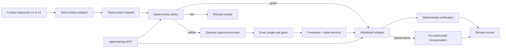

# Architecture

Full technical reference for Governed Action Lab. The [README](../README.md)
covers the pitch and quick start; this document covers how it works.

## Diagram



The contracts, canonical hashing, context adapter, policy, approval provider,
executor, sandbox adapter, stores, CLI, MCP server, and browser are separate
layers. Browser decisions are compiled from the same core policy code rather
than reimplemented.

Dependency-injected hosts may evaluate a non-public policy only by supplying a
trust binding that matches the policy ID, version, and canonical manifest
digest. Rules may additionally carry an exact `allowedResourceIds` allowlist.
Host policies may select the explicit `host_local_reversible` environment and
an injected adapter ID; the policy binds both values and current-state recheck
preserves them for the executor.
These checks fail closed. This repository still includes no production adapter,
and the bundled public policy and portable proof remain synthetic.

## Contracts

Strict Zod schemas reject unknown keys at persisted and transport boundaries:

- `governed-action-review/v1`
- `governed-action-review/v2` for evidence-bound diagnostic v2
- `governed-action-request/v1`
- `governed-action-decision/v1`
- `governed-action-approval/v1`
- `governed-action-receipt/v2`
- `governed-action-policy/v1`
- dual-read consumer for `context-layer-diagnostic/v1` and evidence-bound `v2`

Canonical JSON recursively sorts keys and rejects non-JSON values before
SHA-256 hashing. An approval binds both the complete request digest and the
decision digest. The executor also requires an exact match to a host-supplied
verified principal; the bundled CLI and MCP server use a fixed synthetic identity
and do not provide authentication. Receipts describe bounded resources and
before/after hashes. Each receipt also carries a runtime-assigned `actionId`
and may carry a `parentActionId` when the trusted runtime directly knows the
structural parent. That correlation is an audit trail, not delegation
authorization or proof that child authority was attenuated from a parent.
Before execution, each idempotency key is atomically and permanently bound to
the complete action digest. A concurrent duplicate reports in-progress, a
different action reports a conflict, and any receipt with effects is replayed
rather than executed again. A same-action refusal with no effects may be
retried after its missing precondition is supplied.

The file-backed synthetic path also checkpoints the exact approval, action ID,
start time, and adapter recovery state before mutation. If that local process
dies, a later run may take over only after the operating system reports that no
process has the recorded PID. The adapter must then reconcile the checkpoint against the
current sandbox: an absent effect is executed once, an exact present effect is
recorded without executing again, and any third state remains blocked. There is
no age-based claim expiry. This is deliberately a single-host synthetic crash
recovery demonstration, not a distributed lease protocol. PID reuse can
conservatively leave a dead claim blocked; it cannot authorize takeover or a
duplicate effect.

Bundled policy `1.3.0` makes diagnostic v2 the public default and explicitly
retains v1 as a compatible evidence format. Policy `1.2.0` was the dual-read,
v1-default transition; legacy policy `1.1.0` remains v1-only. Changing the
policy version deliberately invalidates earlier decision and approval digests.

Receipt stores append during their ordinary API flow, but the verifier checks one
presented receipt rather than an anchored sequence. Digest verification detects
changed receipt content when its recorded digest is left unchanged; it cannot
detect whole-receipt deletion, valid insertion, reordering, or duplication, and it
does not defend against a process that controls the machine and can rewrite both
data and code.

## MCP tools

| Tool | Effect |
|---|---|
| `evaluate_action` | Read-only validation and policy evaluation |
| `explain_action_decision` | Read-only explanation |
| `simulate_action` | Read-only projected effect |
| `execute_approved_action` | Synthetic sandbox only; requires a separate stored approval |
| `verify_action_receipt` | Read-only schema and digest verification |

There is no approval-creation MCP tool. The executor tool accepts an action
identifier, not an approval payload or command string.

## Evaluations

`npm run eval` executes 35 deterministic adversarial cases and compares actual
structured output with explicit expected output. Coverage includes:

- unknown action, adapter, environment, diagnostic, and command-shaped input;
- green mutation mismatch and red action with a valid-looking approval;
- changed, expired, replayed, tampered, and earlier-decision approvals;
- evidence expiry, missing evidence, invalid quality, contradictory
  assessments, and newer success before retry;
- exact replay, concurrent and cross-action idempotency conflicts, failures
  and process death before and after effect, ambiguous orphan recovery,
  compensation, verification mismatch, and tampered receipts;
- absent approval providers, MCP capability limits, forged browser decisions,
  generated-demo drift, policy change after approval, review-only preparation,
  and review-packet tampering.

`npm run qa:responsive` launches an isolated local Chrome instance and asserts
that the document and every rendered element remain within 320, 375, and 390px
viewports.

## Threat model and limits

The lab demonstrates deterministic refusal and approval binding. It does not
provide:

- production authorization, OAuth, RBAC, multi-tenancy, or machine isolation;
- a security boundary against a process already controlling the local machine;
- tamper-proof or externally anchored audit logs;
- proof that supplied evidence is factually true;
- a production, network, repository, deployment, communication, credential,
  financial, account, or deletion adapter;
- natural-language risk classification or arbitrary command execution;
- a replacement for Context Layer Lab retrieval or a private write-admission
  protocol.

Freshness means evidence remains within its declared time boundary. It is not a
truth score. The public synthetic executor proves orchestration semantics, not
production safety.

## Repository map

```text
data/       fixed public policy
docs/       dependency-light local-first console, and this reference
evals/      explicit adversarial expectations
examples/   synthetic diagnostic and fixture metadata
scripts/    generated-runtime, drift, responsive, and public-safety gates
src/        contracts and independent governance layers
test/       unit and protocol contract tests
```

## Development checks

```bash
npm run typecheck
npm test
npm run eval
npm run demo:check
npm run qa:responsive
npm run public-safety:check
npm run check
```

`npm run check` is network-independent after installation. Runtime files and
the public sample are generated deterministically; drift fails the gate.

Before publishing, configure a private newline-delimited pattern file and
install the fail-closed pre-push hook:

```bash
git config publicSafety.patternsFile /path/to/private-patterns
npm run public-safety:install
```

The hook scans the current tree and every outgoing commit, so adding and then
deleting private data in one push is still blocked. CI repeats the generic scan.

## Rollback

Each implementation phase is a separate commit. Revert the smallest phase
commit rather than resetting unrelated work:

```bash
git revert <phase-commit>
```

## Full command reference

```bash
npm run fixture:fresh -- --output /tmp/governed-diagnostic.json

npm run action -- propose \
  --diagnostic /tmp/governed-diagnostic.json \
  --action retry_failed_lane \
  --lane site-refresh \
  --output /tmp/action-request.json

npm run action -- prepare \
  --diagnostic /tmp/governed-diagnostic.json \
  --request /tmp/action-request.json \
  --output /tmp/action-review.json \
  --brief-output /tmp/action-review.md
```

`propose` and `prepare` are separate passes. `propose` creates the typed request;
`prepare` accepts that existing request, independently regenerates its evidence
binding from the diagnostic, rejects any mismatch, then evaluates policy and
simulates the projected effect as a strict review packet:
`governed-action-review/v1` for diagnostic v1 or `governed-action-review/v2`
for diagnostic v2. It never approves or executes.
The optional six-line brief reports the action, evidence boundary, required
authority, and next step without a model call.

The lower-level lifecycle remains available for inspecting each boundary:

```bash
npm run action -- propose \
  --diagnostic /tmp/governed-diagnostic.json \
  --action retry_failed_lane \
  --lane site-refresh \
  --output /tmp/action-request.json

npm run action -- evaluate \
  --diagnostic /tmp/governed-diagnostic.json \
  --request /tmp/action-request.json \
  --output /tmp/action-decision.json

npm run action -- approve \
  --request /tmp/action-request.json \
  --decision /tmp/action-decision.json \
  --approval-store /tmp/governed-action-demo/approvals.json \
  --operator reviewer \
  --output /tmp/action-approval.json

npm run action -- execute \
  --diagnostic /tmp/governed-diagnostic.json \
  --request /tmp/action-request.json \
  --decision /tmp/action-decision.json \
  --approval-store /tmp/governed-action-demo/approvals.json \
  --receipt-store /tmp/governed-action-demo/receipts.json \
  --sandbox /tmp/governed-action-demo/sandbox \
  --output /tmp/action-receipt.json
```

`approve` is an interactive operator command. It displays the exact target,
effect, evidence, five-minute expiry, and rollback contract before accepting
the literal confirmation `APPROVE`. `execute` discovers a separately stored
approval and rejects `--approve`, `--yes`, and inline approval text.
`fixture:fresh` shifts the bundled evidence-bound v2 example to the current wall
clock so its one-day evidence window remains meaningful; the library retains v1
compatibility. Production execution always uses the system clock and has no
`--at` override.

## Context Layer Lab handoff, in detail

[Context Layer Lab](https://kaagemusha.github.io/context-layer-lab/) answers:
**what current evidence supports the conclusion?**

Governed Action Lab answers: **given that evidence, what may execute, under
whose authority, and with what receipt?**

The public default consumes evidence-bound `context-layer-diagnostic/v2` from
producer commit `5d74a5c5a0d1269a916612bcc69db60003ea69b8`. A frozen compatibility
fixture retains `context-layer-diagnostic/v1` from producer commit
`b0179a8e365ab35691864e55d5792db1bdefbcb2`. Metadata binds each
exact producer artifact and fixture SHA-256; `npm run contract:check` fails if
either local handoff drifts. During paired development, add
`-- --producer-root ../context-layer-lab` to verify the frozen bytes against a
sibling producer checkout. The consumer validates the complete packet, binds
the request to its SHA-256 digest, independently checks the selected lane's
latest raw receipt and due window, and verifies v2 typed evidence bindings. It
does not import sibling source files or duplicate the producer's broader health
logic. The public sample is v2; imported v1 and v2 packets are both governed.

See [pair-walkthrough.md](pair-walkthrough.md) for the real, runnable
end-to-end command sequence.
